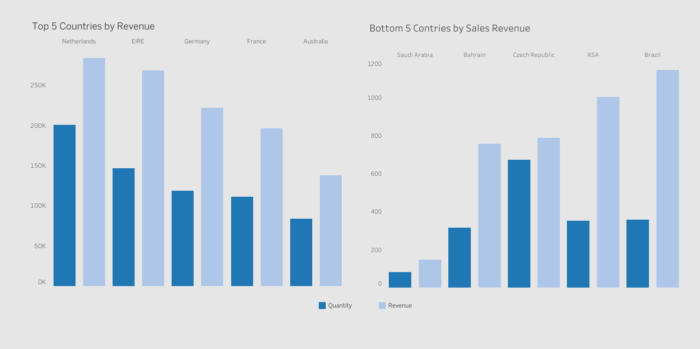

# Background
You have been asked by the CEO and CMO to provide visuals on the metrics that they wish to analyse for the online retail store. You will gather the requirements and provide them with the type of visual that would be best suited to the scenario. The senior management wants to understand how their business is performing and what areas are the key strengths of the company. They are also focused on identifying opportunities that would lead to growth and generate more revenue in the future.

## Table of Contents
1. Business Questions
2. Executive Summary
3. Detailed insights
4. Recommendations

## Business Questions
1. Which countries exhibit strong online retail buying behavior?
2. Which countries (excluding the UK) are performing well in online retail sales?
3. How does the purchase behavior of the top three countries by sales revenue differ?
4. How often do customers return after making a purchase?
5. What is the customer purchase latency based on the month of their first purchase?
6. Which countries contribute to 80% of the total sales revenue?
7. What are the top and bottom 10 products contributing to sales revenue (excluding the UK)?
8.  Help improve the understanding of the customer base by their purchase behaviour.
9. Which products are selling well but generating lower sales revenue, and which are selling less but generating higher sales revenue?

## Executive Summary

## Detailed insights
### Top and Bottom Countries by Sales Revenue Performance

- The top five markets are —Netherlands, EIRE, Germany, France, and Australia—collectively driving a significant portion of our sales revenue. However, there are stark contrasts. At the other end of the spectrum, we see countries such as Saudi Arabia, USA, and Bahrain, where sales revenue is considerably lower with only a few hundreds of dollars.
- 
### Average Sales and Average Order Value of Countries
### Purchase Behaviour of Top 3 Countries by Sales Revenue

1. Performance by Country:
**EIRE:** 
- Revenue peaks in July (~40K) and September (~35K), with noticeable troughs in March (~10K) and November (~10K).
- Order Count follows a similar pattern, with peaks in September (~1,000 orders) and November (~950 orders), indicating high customer activity.
- Quantity Sold also spikes in July (~27K) and September (~25K), suggesting these months are critical for maximizing sales.
**Germany:**
- Revenue peaks in July (~30K) and September (~30K) but does not dip as sharply during the off-season compared to EIRE.
- Order Count remains consistently higher than EIRE, peaking in September (~1,050 orders).
- Quantity Sold shows a steady upward trend until July (~23K), with a slight dip afterward, followed by another peak in September (~22K).
**Netherlands:**
- Performance is relatively flat for Order Count whereas Revenue and Quantity Sold metrics exceeds both the other nations, except for the lowest performance in April. This reflects that the AOV is higher for the Netherlands compared to the other two leading nations.
2. Seasonality:
- Mid-Year Peak: All countries see a sharp rise in sales metrics around July, driven by higher Quantities Sold.
- Late-Year Peak: Another spike occurs in September for EIRE, October for Netherlands and Germany, indicating potential seasonal campaigns or higher consumer demand during these months.
- Year-End Drop: December shows a decline across all metrics, suggesting reduced market activity during this period.
3. Country Rankings:
- EIRE dominates Revenue, consistently outperforming Germany and the Netherlands in most months.
- Germany leads in Order Count, indicating a high number of smaller transactions compared to EIRE.
- Netherlands takes the lead for the Quantity Sold and competes head on with EIRE in Revenue. 

### Customer Purchase Frequency
### Customer Purchase Latency 
### Sales Revnue Pareto of Countries
### Best and Worst Performing Products
### Understanding Customer Base 
#### Best Customers:
The most valuable customers who purchase frequently, have made recent purchases, and spend significantly more compared to others.
- Highest revenue among all segments, with a significant spike in November and another high in September.
- March, May, and August show noticeable dips.
#### Loyal Customers:
Customers who purchase regularly and are likely to maintain their loyalty to the business.
- Moderate revenue contribution, with a clear peak in November and a slight dip in March and August.
- Consistent throughout the year but shows no extreme variability like Best Customers.
#### Potential to Become Loyal Customers:
These customers have shown recent interest in purchasing and could become loyal if nurtured.
- Slow revenue growth from October, with a significant rise in November and a peak in December.
- Minimal contributions before October.
#### Occasional Buyers: 
Customers who purchase sporadically, with average spending and relatively low purchase frequency.
- Very minimal contribution, with no noticeable peaks or trends throughout the year.
#### Lost Customer:
Lost Cheap Customers: These are inactive customers who spent little and purchased infrequently when they were active.

Lost Best Customers: These were once among the best customers but have stopped purchasing recently.
- A distinct segment of customers has completely stopped purchasing, particularly during the last two months of the year (October, November, and December).
#### Look Out Buyers:
These customers have moderate purchasing activity, but they are at risk of becoming inactive due to declining recency or frequency.
- Minimal contribution, with slight activity during October and November and exhibits irregular purchasing behavior.
- Flat and declining trends in other months while no purchase after October. 
#### Big Spenders:
Customers who spend a lot of money but may not purchase as frequently or recently as the best customers.

- Consistent revenue generation throughout the year

### Product Performance by Revenue vs Purchase Volume 
