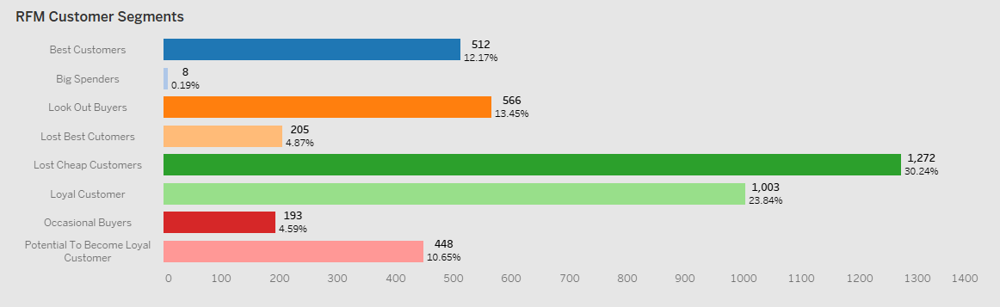

## Table of Contents
- [Background](#background)
- [Business Questions](#business-questions)
- [Executive Summary](#executive-summary)
- [Detailed Insights](#detailed-insights)
   - [Monthly Sales Revenue for the Year](#monthly-sales-revenue-for-the-year)
   - [Top and Bottom Countries by Sales Revenue Performance](#top-and-bottom-countries-by-sales-revenue-performance)
   - [Global Average Sales Performance](#global-average-sales-performance)
   - [Average Order Value of Countries](#average-order-value-of-countries)
   - [Purchase Behaviour of Top 3 Countries by Sales Revenue](#purchase-behaviour-of-top-3-countries-by-sales-revenue)
   - [Sales Revenue Pareto of Countries](#sales-revenue-pareto-of-countries)
   - [Best and Worst Performing Products](#best-and-worst-performing-products)
   - [Customer Purchase Frequency](#customer-purchase-frequency)
   - [Customer Latency](#customer-latency)
   - [Cohort Anallysis](#cohort-analysis)
   - [Understanding the Customer Base](#understanding-the-customer-base)
   - [Product Performance by Revenue vs Purchase Volume](#product-performance-by-revenue-vs-purchase-volume)
   - [List of Top 10 Customers](#list-of-top-10-customers)
- [Recommendations](#recommendations) 
   
## Background
An online retail store has hired you as a consultant to review the data provided by the client and find out insights valuable to the CEO and CMO. The business is performing well and the management wants to analyse what the major contributing factors are to the revenue so they can strategically plan for next year's expansion. They would also like to view different metrics based on the demographic information that is available in the data.

## Business Questions
1. Identify the countries with the highest customer engagement and transaction volumes in our online retail platform.
2. Highlight the top-performing countries in terms of sales revenue outside our primary market, the UK.
3. Analyze the differences in customer purchasing trends among our top three revenue-generating countries.
4. Determine the key markets that account for the majority of our revenue to guide resource allocation.
5. Identify our best and worst-performing products globally, to optimize inventory and focus on profitability.
6. What are the distribution and trends of purchase frequency among our customers?
7. Based on the purchase history, when is the optimal time to re-engage customers to encourage repeat purchases?
8. What insights can we gain from customer purchase patterns to classify them into actionable segments for retention and growth?
9. Which products are selling well but generating lower sales revenue, and which are selling less but generating higher sales revenue?
10. Who are our top 10 customer with highest sales revenue?

## Executive Summary
The total **annual gross revenue** stands at **$8.94M** and 18,500 total transactions, with **October recording the highest sales revenue** and an **uncharacteristic drop in December**. **80% of sales** are concentrated in **eight key countries**—Netherlands, EIRE, Germany, France, Australia, Spain, Switzerland, and Belgium. **75% of customers** make only **1-5 purchases per year**, and the **high number of lost cheap and lost loyal customers** highlights **low purchase frequency** and **serious retention concerns**.
## Detailed Insights
### Monthly Sales Revenue for the Year

#### 1. Revenue Peaks and Lows
##### **Peak Revenue Month:** October (196,972)
  - October marks the highest revenue, indicating strong customer engagement or possible seasonality factors such as promotions or holidays.
##### **Lowest Revenue Month:** December (45,134)
  - A steep drop occurs in December, which is unusual since December often sees high sales due to holiday shopping. This may warrant an investigation into supply chain disruptions, inventory issues, or reduced marketing efforts.
#### 2. Monthly Revenue Fluctuations
##### **Steady Decline in Early Q1:**
  - Revenue decreases from January (128,583) to February (91,793) and then to April (52,274). This may indicate slower post-holiday shopping trends or weaker demand in the early months.
##### **Mid-Year Recovery (May to August):**
  - A consistent increase in revenue is seen from May (125,813) to August (148,874). This could correspond to back-to-school shopping or seasonal demand.
##### **Sharp Growth in Q4:**
  - Revenue peaks in October (196,972), likely driven by major events like Halloween sales or early holiday promotions. November also retains high sales at 179,017 before the sharp decline in December.
#### 3. Seasonal and Trend Analysis
##### **Seasonality Effects:**
- Low in early spring (March-April).
- Gradual growth during summer.
- Peak in autumn (October).
- Uncharacteristic drop in December.
##### **Possible Campaign Impacts:**
- Revenue spikes could be attributed to well-timed promotional campaigns, whereas the dips might point to gaps in marketing or inventory planning.
#### 4. Anomalies
The steep decline from November (179,017) to December (45,134) is a major anomaly. Given that December is typically a high-revenue month, this requires further analysis:
1. Was there a lack of inventory or shipping constraints?
2. Did customers shift to competitors during the holiday season?
3. Were there external factors (e.g., economic slowdown, weather disruptions)?

### Top and Bottom Countries by Sales Revenue Performance

The top five markets are —Netherlands, EIRE, Germany, France, and Australia—collectively driving a significant portion of our sales revenue.
- Netherlands leads in both revenue and quantity, indicating high sales performance overall.
- EIRE generates the second-highest revenue, along with slight dip in the quantity sold. 
- Germany and France follow afterward, with similar quantities sold. However, Germany outperforms France in revenue, as reflected by its higher median order value and the upper range of order revenue, indicating stronger sales performance compared to France.
- Australia has the lowest revenue and quantity among the top 5.

At the other end of the spectrum, we see countries such as Saudi Arabia, USA, and Bahrain, where sales revenue is considerably lower with only a few hundreds of dollars.

- Brazil, followed by South Africa (RSA), leads in revenue among the bottom five markets, despite lower quantities sold. This is due to their higher average order value (AOV), which contributes to stronger sales revenue compared to the other countries in this group.
- The Czech Republic and Bahrain exhibit similar revenue patterns, although the quantity sold in the Czech Republic is nearly double that of Bahrain. This difference is attributed to Bahrain’s higher average order value (AOV), which compensates for the lower sales volume.
- Saudi Arabia performs the lowest in both revenue and quantity.
  
### Global Average Sales Performance

### Average Order Value of Countries

- The average AOV varies significantly across countries, with most values concentrated between $16 and $50, as indicated by the interquartile range. This range highlights a standard pattern of customer spending across the majority of countries.
- Japan, Netherlands, Australia, and Sweden stand out with notably high AOVs, appearing as outliers. Among these, Japan has the highest AOV, showcasing its dominance in premium purchasing behavior. Additionally, Netherlands and Australia, both of which rank in the top 5 countries by sales revenue, align their high revenue with elevated AOVs. Sweden and Japan, while not in the top 5, still maintain a strong position, ranking 9th and 10th in sales revenue, respectively.
- Germany and France, ranked 3rd and 4th in the top 5 countries by sales revenue, display a different trend. Their AOV falls on the lower end of the range, at $25, indicating a focus on high-volume transactions rather than premium, high-value purchases.
  
### Purchase Behaviour of Top 3 Countries by Sales Revenue

#### 1. Performance by Country:
##### **EIRE:**
- Revenue peaks in July (~40K) and September (~35K), with noticeable troughs in March (~10K) and November (~10K).
- Order Count follows a similar pattern, with peaks in September (~1,000 orders) and November (~950 orders), indicating high customer activity.
- Quantity Sold also spikes in July (~27K) and September (~25K), suggesting these months are critical for maximizing sales.
##### **Germany:**
- Revenue peaks in July (~30K) and September (~30K) but does not dip as sharply during the off-season compared to EIRE.
- Order Count remains consistently higher than EIRE, peaking in September (~1,050 orders).
- Quantity Sold shows a steady upward trend until July (~23K), with a slight dip afterward, followed by another peak in September (~22K).
##### **Netherlands:**
- Performance is relatively flat for Order Count whereas Revenue and Quantity Sold metrics exceeds both the other nations, except for the lowest performance in April. This reflects that the AOV is higher for the Netherlands compared to the other two leading nations.
#### 2. Seasonality:
- Mid-Year Peak: All countries see a sharp rise in sales metrics around July, driven by higher Quantities Sold.
- Late-Year Peak: Another spike occurs in September for EIRE, October for Netherlands and Germany, indicating potential seasonal campaigns or higher consumer demand during these months.
- Year-End Drop: December shows a decline across all metrics, suggesting reduced market activity during this period.
#### 3. Country Rankings:
- EIRE dominates Revenue, consistently outperforming Germany and the Netherlands in most months.
- Germany leads in Order Count, indicating a high number of smaller transactions compared to EIRE.
- Netherlands takes the lead for the Quantity Sold and competes head on with EIRE in Revenue. 

### Sales Revenue Pareto of Countries

- The top 8 countries, Netherlands, EIRE, Germany, France, Australia, Spain, Switzerland, and Belgium account for 80% of total sales, while the remaining countries collectively contribute just 20%.

### Best and Worst Performing Products

### Customer Purchase Frequency

Each bin represents the frequency of distinct customers based on their total purchases, grouped in intervals of 5.
- The first bin has a huge count of 3,114 customers, i.e. 74% of the customers made purchases between 1 and 5.
- The second bin (6–10 purchases) has 713 customers at 16.9%, which is a significant drop-off from the first bin.
- Beyond the 10th bin (50+ purchases) with less than 0.1%, the counts become negligible, with very few customers making extremely high numbers of purchases.

### Customer Latency 
- The average customer latency is 40 days (i.e. the gap between the purchases), and 66.4% of customers align with this behaviour which means customer returns roughly 9 times per year at most. However, since only 16% make 6-10 purchases annually, it suggests that most customers:
   - Have higher variability in latency as the standard deviation in customer latency is of 52 days.
   - Drop off before making frequent repeat purchases.
  
### Cohort Analysis 

#### 1. Months with the Highest Same-Month Repeat Purchases
- **April:** Stands out with 13.28% repeat purchases in the same month, the highest among all months.
- **June:** Has a notable 9.09% repeat purchase in the same month, reflecting strong initial engagement.
- **May:** Follows closely with 8.75% of customers repeating in the same month.
- **February:** Has a 24.81% of the repeat purchase in one month time. 
  
#### 2. Months with Overall Good Repeat Percentage (High Frequency and High %)
- **April:** Performs exceptionally well with high percentages across all months, peaking at 41.37% in the third month. It has consistent repeat purchases through months 1 (35.67%), 2 (36.24%), 4 (30.74%), and 5 (31.31%).
- **February:** Shows a strong early repeat purchase rate with 24.81% in the first month and good consistency over subsequent months, with 20.93% by the fourth month.

#### 3. Months with Least Repeat Purchase of Customers
- **March:** Has the lowest same-month repeat rate at 4.76%, and overall repeat activity is weaker, peaking at only 18.61% in the fourth month.
- **January:** Although it starts with a decent same-month repeat rate (7.37%), it does not sustain strong repeat percentages across months, tapering off to 12.11% by the sixth month.

#### 4. Moderate Performance:
- May and June have moderate performance for following few months but start picking up by 4th (18.13%) and 3rd (25.84%) month respectively. This could be due to the annual seasonality.

### Understanding the Customer Base
 

- 35% of the customer base consists of lost cheap customers and lost best customers, indicating a potential revenue gap and a need to assess the reasons behind customer churn. Meanwhile, 36% of customers fall into high-value segments—best, loyal, and big spenders—who contribute significantly to revenue, making their retention a priority. Additionally, 10.6% of customers have the potential to become loyal, representing an opportunity to improve customer retention and customer life time value through targeted retention efforts. 

#### Best Customers:
The most valuable customers who purchase frequently, have made recent purchases, and spend significantly more compared to others.
- Highest revenue among all segments, with a significant spike in November and another high in September.
- March, May, and August show noticeable dips.
#### Loyal Customers:
Customers who purchase regularly and are likely to maintain their loyalty to the business.
- Moderate revenue contribution, with a clear peak in November and a slight dip in March and August.
- Consistent throughout the year but shows no extreme variability like Best Customers.
#### Big Spenders:
Customers who spend a lot of money but may not purchase as frequently or recently as the best customers.
- Consistent revenue generation throughout the year.
#### Look Out Buyers:
These customers have moderate purchasing activity, but they are at risk of becoming inactive due to declining recency or frequency.
- Minimal contribution, with slight activity during October and November and exhibits irregular purchasing behavior.
- Flat and declining trends in other months while no purchase after October.
#### Lost Customer:
Lost Cheap Customers: These are inactive customers who spent little and purchased infrequently when they were active.

Lost Best Customers: These were once among the best customers but have stopped purchasing recently.
- A distinct segment of customers has completely stopped purchasing, particularly during the last two months of the year (October, November, and December).
#### Potential to Become Loyal Customers:
These customers have shown recent interest in purchasing and could become loyal if nurtured.
- Slow revenue growth from October, with a significant rise in November and a peak in December.
- Minimal contributions before October.
#### Occasional Buyers: 
Customers who purchase sporadically, with average spending and relatively low purchase frequency.
- Very minimal contribution, with no noticeable peaks or trends throughout the year.
  
### Product Performance by Revenue vs Purchase Volume 

- Products such as 22423, 47566 and, 85123A are high-revenue drivers despite lower purchase volumes, suggesting they cater to niche or premium segments.
- Product 23843 and 23166 stands out as a high-volume, high-revenue item, indicating strong mass-market appeal.
- Product 84077 have high-volume albeit being a low-revenue product, i.e. a frequently purchased low-cost item. Its consistent demand could make it essential for driving overall transaction volumes, even if its individual contribution to revenue is limited.

### List of top 10 Customers

## Recommendations
1. Improving Customer Retentiona and Repeat Purchases:
   
   - **Loyalty programs:** Address customer disengagement after 1-5 purchases and reward high-frequency buyers by introducing a tiered reward system:
     - Store points based on order value, redeemable as discounts for low-frequency buyers.
     - Pre-sale access for best and loyal customers.
     - Win-back strategies for inactive customers or those showing early disengagement signs.
   - **Personalized Re-targeting:** Due to high variability in customer latency, implement automated, behavior-based re-engagement strategies:
     - Frequent buyers (low latency): Encourage repeat purchases through subscription models or store points.
     - Mid-range buyers (40-60 days): Use proactive reminders via SMS and email to maintain engagement.
     - Long-gap buyers (90+ days): Launch win-back campaigns featuring discounts, personalized recommendations, and urgency-based offers.
   - **Subscription or Auto-Replenishment Model:** Encourage more frequent purchases by offering a subscription model for high-repeat, low-cost like Product 84077.
   - **Leverage Core Customer Insights:** Analyse customer behaviour and purchase preference of repeat customers to enhance and customize the loyalty programs improve targeted marketing.
---
2. Sesonal and Promotional Strategy:
   
   - **Fix December Drop-off:** Investigate the December sales decline—possible causes include lack of marketing campaigns, inventory issues, or competition.
       - Run aggressive holiday promotions in December.
       - Ensure stock availability to prevent lost sales.
   - **Capitalize on Peak Months:** Increase marketing efforts in October and July, when sales naturally peak.
   - **Target Cohorts in February, April, May, and June:** Since these months have the highest repeat purchase rate (for 0-6 month), run targeted discounts to encourage repeat buyers.
   - **Preemptive Engagement before the Dip and Smoothing Demand during Dip:** If the dip in the months of February, April and July are predictable i.e. due to the seasonality then giving exclusive early access to best and loyal customers, provinding bundle offers, subscription-based orders, urgengy-based promotions will pull the demand forward and smooth out the seasonality.

---
3. Product Strategy:

   - **Increase Marketing for High-Revenue, Low-Volume Products:** Products 22423, 47566, and 85123A have strong revenue potential—position them as premium offerings.
   - **Bundle High-Volume, Low-Revenue Products:** Product 84077 sells frequently but generates low revenue. Bundle it with complementary products to increase AOV.
   - **Inventory Optimization:** Reduce stock for worst-performing products and shift focus to high-revenue and high-volume items.
---
4. Country-Specific Stategies:
   
   - **Focusing on Top Revenue Generating Markets:** Strengthening market presence in countries top 3 markets i.e. Netherlands, EIRE and Germany.
   - **Expand into High-AOV Markets:** Japan, Australia and Sweden have the highest AOV—introduce premium product bundles in these regions while also ranking within 10 in average revenue of the countries.
   - **Localized Pricing and Promotions:** Offer country-specific pricing strategies for high-volume but low-revenue countries like France and Germany and high-volume high-revenue counties like Netherlands and Australia.
---
5. Top Customer Relationship Management:
   
   - **Exclusive VIP Treatment for Top 10 Customers:** Provide early access to new products, personalized discounts, and dedicated support for top customers who contribute the most revenue.
   - **Public Recognition & Shout-Outs:** Feature VIP customers in social media spotlights, leaderboards, or exclusive newsletters to recognize their loyalty and incentivize other customers to stay engaged.
   - **B2B or Bulk Buying Incentives:** B2B or Bulk Buying Incentives: If these customers purchase in bulk, offer special pricing or account management to deepen their relationship.
---
6. Operational Improvements
   
   - **Investigate Cohort Drop-Offs:** Cohort analysis shows some months (e.g., March and January) with poor retention—analyze if it's due to product seasonality or lack of engagement.
   - **Improve Shipping & Logistics:** If December’s decline was due to delivery delays, optimize logistics and communicate shipping timelines clearly.
 
## Clarifying Questions, Assumptions, and Caveats

